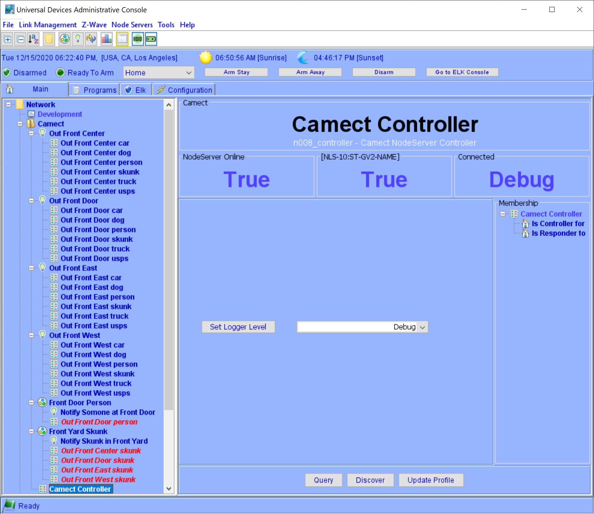
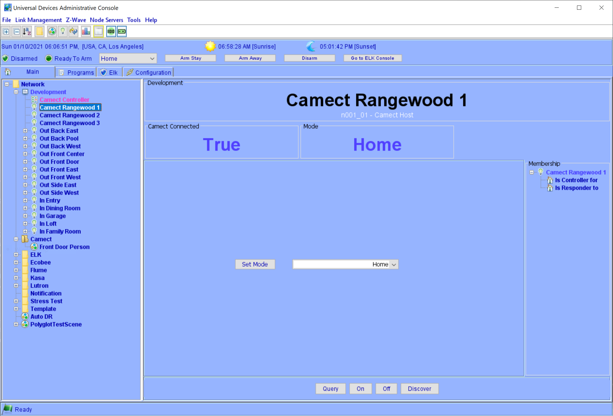
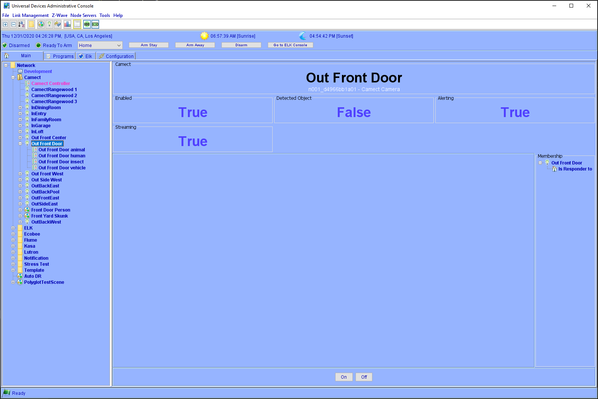
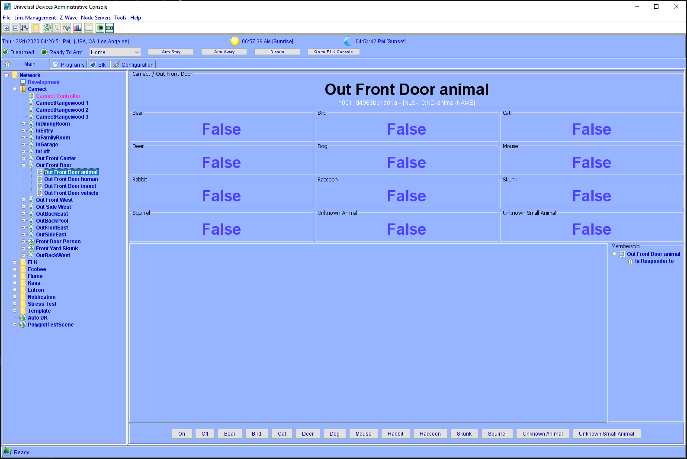
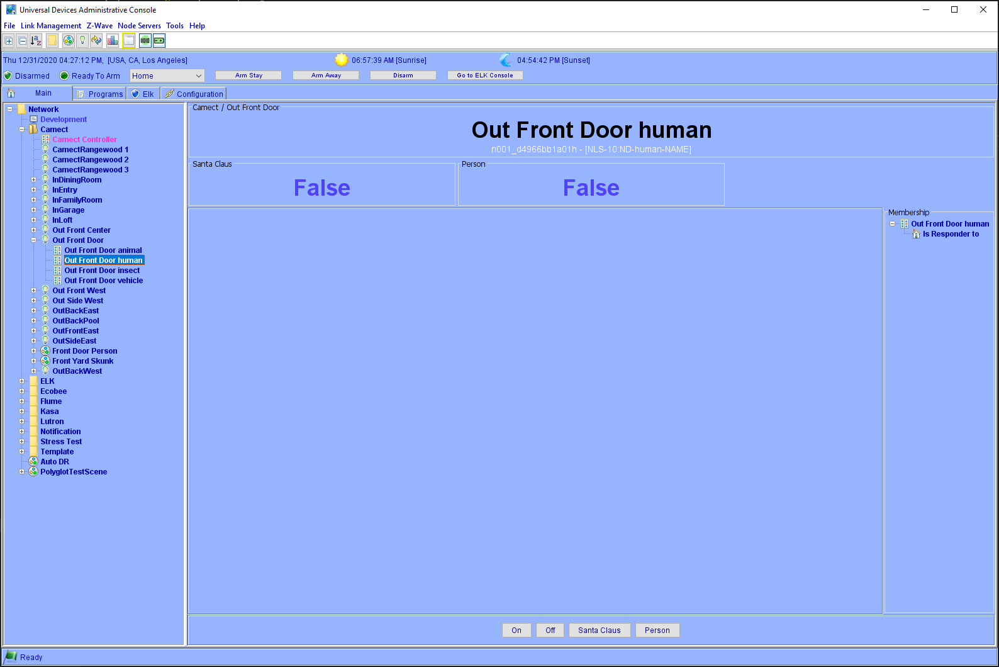
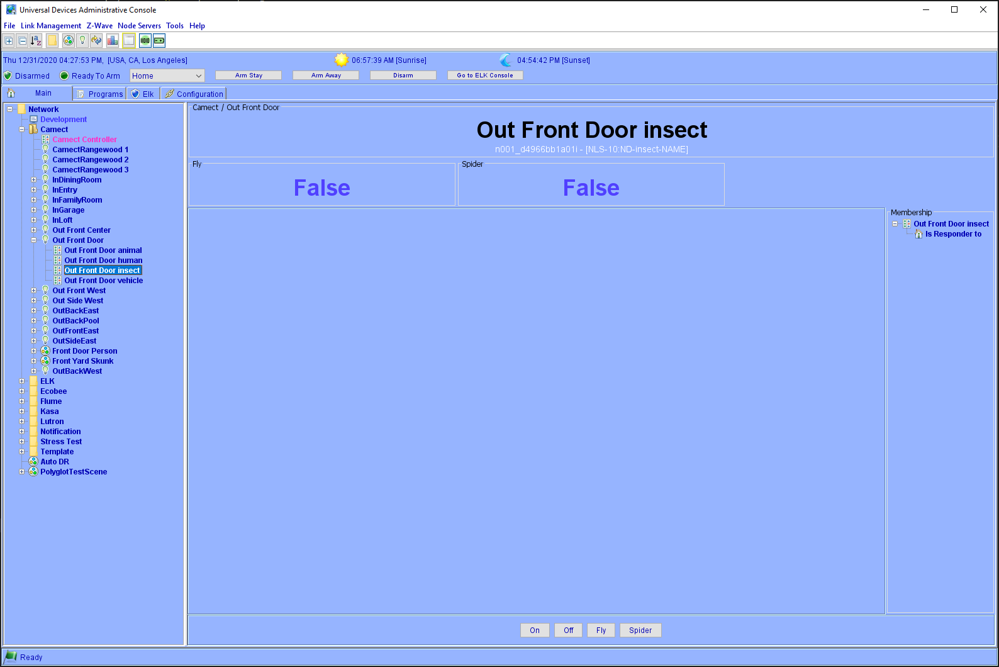
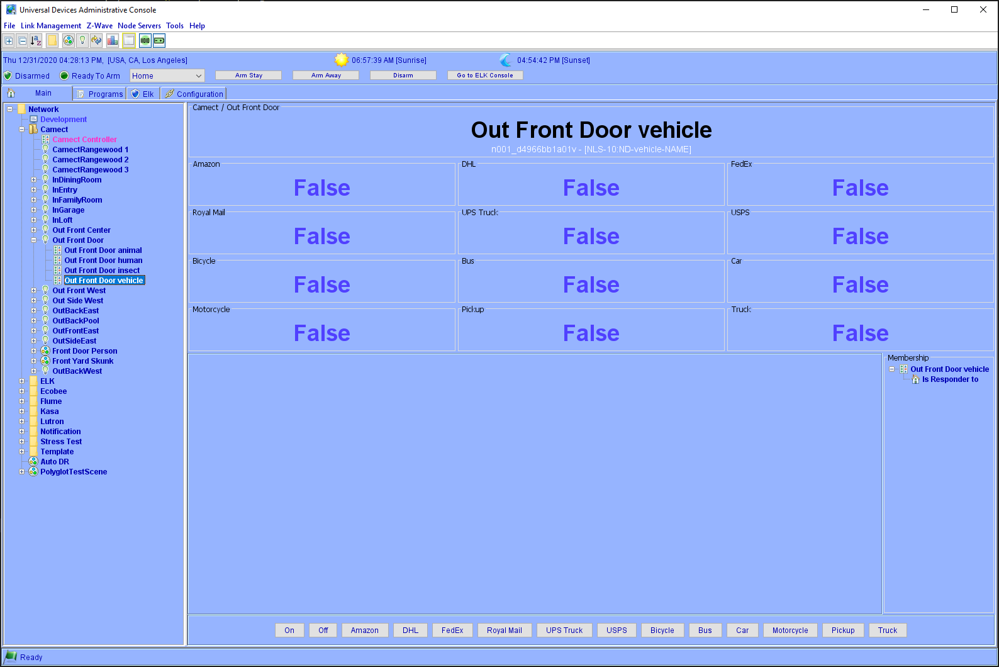
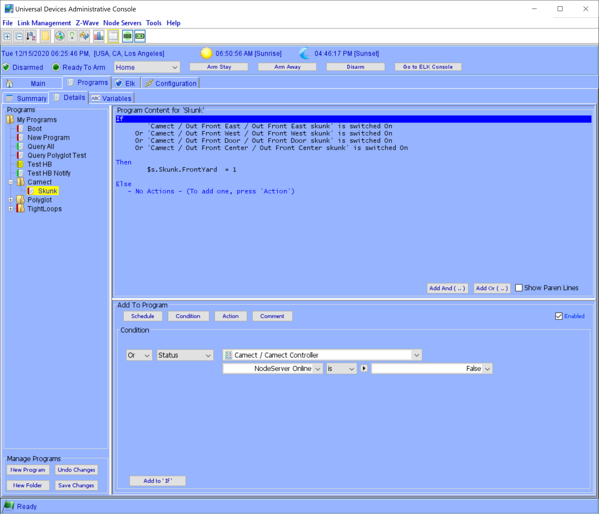

# UDI Polyglot V3 Camect Nodeserver

This is a Polyglot Nodeserver for the [Universal Devices](https://www.universal-devices.com/) ISY to integrate the [Camect](http://camect.com) System.

This is the initial released version so it may change drastically but hopefully not.  We have spent a lot of time trying to figure out the best way to handle all the information available.  But if you have better ideas please feel free to let me know.

If you don't have a Camect yet, or will be purchasing another one then please visit my link [Camect Affiliate link](https://camect.kckb.st/edc3936e) to purchase so I get credit for it.

## Installation

Install from the Polyglot Store.  See [Configuration](POLYGLOT_CONFIG.md) on the configuration page after installing.

## Requirements

This has been tested on an RPI running the latest Buster release and the Polisy with all updates.  

- You must have Python verison 3.6 or newer.
- This uses the [Camect Python Library](https://github.com/camect/camect-py)

## Using this Nodeserver

After configuring and restarting you should get a Nodes for
- Each Camect Host
- Each Camera that is enabled on the Camect hosts
- Each Camera has mltiple ObjectDetected nodes for the major types of objects currently detected by Camect
  - person
  - vehicle
  - animal
  - insect 

To clarify, make sure when you restart after setting the configuration data that all cameras you want added to the ISY are enabled in Camect. If you have cameras off in Home Mode, then make sure to enable Default Mode.  The reason for this is when you have multiple Camect devices all cameras show up in each Camect device so we don't want the disabled ones to show up.  Hopefully someday Camect will add settings to control this better...  To add them later you must do a discover on the Camect Host node individually.

On restarts all known Camect hosts and cameras are added, it does not check for newly added cameras unless you run discover on a Camect host by selecing it in the admin console and clicking discover.  If a new Camect host has been added since last restart or discover on the controller, then that host and all it's enabled cameras will be added to the ISY.  Make sure if your discover on a Camect Host that all Cameras you want to control in the ISY are enabled.  If there are some in the ISY and are disabled when you run discover, they will no longer be connected to the ISY, so be careful.

### Controller

The main controller node.

- The Status shows:
  - Nodeserver Online: Nodeserver connected to Polyglot
  - Mode: The Mode of all camects
    - Default - All Camects in Default Mode
    - Home - All Camects in Home Mode
    - Mixed - Mixutre of Home/Default
  - Comects Configured: Number of Camect Hosts configured
  - Camects Connected: Number of Camect Hosts connected
  - Logger Level: The current Logging level

- The Controls available:
  - Set Mode:
    - Set All Camect Hosts to Default or Away Mode.
  - Logger Level
      Usually set to Warning, unless you are debugging issues and want to see all information, but this will use up a lot of disk space.
    - Debug + Modules: All Debug including referenced modules
    - Debug
    - Info
    - Warning
    - Error

### Host

A node is created for each Camect Host device.

- The Satus shows:
  - Camect Connected: Status of connection to your Camect
  - Mode: The Mode of the Camect
    - Default
    - Home

- The Controls available:
  - Set Mode:
    - Set the Camect to Default or Away Mode.

The discover command is used when you add or enable a camera on a Camect then run discover and the new cameras will be added.  Make sure the cameras you have/want in the ISY are enabled in the Camect interface before runnign discover.

### Camera

A node is created for each Camera.

- The Status shows:
  - Enabled: If the Camera is enabled
  - Alerting: If the Camera is sending Alerts
  - Streaming: If the Camera is streaming
- The Controls Available:
  - Enabled: [Not possible yet](https://github.com/jimboca/udi-poly-Camect/issues/1)
  - Alerting

Note that Alerting is updated immediatly from the Camect API when it is changed.  Enabled takes a while (3 minutes by default). Streaming is not ever sent so you must query to get that.  Hopefully Camect will add callbacks for these funcitons in the future.

### Detected Object

The Camera nodes all have a child node for major type of object that can be detect; animal, human, insect, vehicle.  Each of those contain the detailed object type by Camect.  
When the object is detected the status for that object is set to True and a DON is sent to the ndoe.  The status remains True until a different type of detection event is sent by Camect.

- The Status Shows:
  - Detected: True when object has been detected

#### How to use Detected Objects

You can create a program to know when a Skunk enters your front yard 

You can add the nodes to a scene to know when a Person shows up [Person Scene](pics/ScenePerson.png)

## Discussion Forum

The discussion topic for this nodeserver is at the [UDI Camect Nodeserver V2 Forum](https://forum.universal-devices.com/forum/308-camect/)
Please discuss issues there, or if you now for sure it is a bug or a good feature then add it to issues described below.

## Issues

If you have an issue, please add a [udi-poly-Camect gitub issue](https://github.com/UniversalDevicesInc-PG3/udi-poly-Camect/issues) so I can keep track since it is hard to remember issues reported on the Forum.

### IOP 5.4.4 Bug

There is a confirmed bug in IoP verison 5.4.4 which should hopefully be fixed soon, but for now this node server has implemented a workaround.  The bug is that when a node server sends a "Status" event (either True or False) for a Detected Object, the IoP will see this as a "Control" event.  Due to this the node server sends a Status event when it first sees the object, and Control events from then on.  Also, it will never set detected object status's to False due to this bug.

It is always recommended to use "Control" events when writing programs, so when this workaround is eventually removed you will not be rquired to change anything.

## Version History
- 3.0.14: 03/30/2025  
  - IMPORTANT: Check all your "Vehicle" references, ISY driver numbers were wrong in profile.
  - USPS and other deliery vehicles fixed, Camect added 'truck', 'pickup', and 'car' to each of them which broke triggers.  We now strip those from the detected triggers coming from Camect API.
  - Update camect-py library to 0.2.1
  - Remove websockets from requirements since it's included in camect now
  - Added all Driver names so the show up in PG3 UI.
  - Add GPV driver to all Detected Object Nodes for the Object Name detected.  Useful for Notifications.  You must reboot your IoX after restarting the node server for it to show up properly in notifications.
  - Add ERR driver on controller to track issues.  Errors are shown in the PG3x UI. Currently only flags unsupported detected objects.
- 3.0.13: 11/10/2024
  - Force websockets < 13.0 to Avoid issues with Camect API
  - Add "Debug + Modules" log level to help debug issue with camect API
- 3.0.9: 08/15/2022
  - Work around a bug in IoP which reports Control events when Status is changed to either True or False.
    - See [Iop 5.4.4 Bug](#IOP-544-Bug)
- 3.0.8: 06/06/2022
  - Throttle node adds 
  - Add change_node_names user paramater to allow Camect camera names to always be the source, on restart/discover names will change on ISY.
- 3.0.7: 06/05/2022
  - Fix: [AttributeError: 'Host' object has no attribute 'save'](https://github.com/UniversalDevicesInc-PG3/udi-poly-Camect/issues/23)
  - Fix: [Latest version not adding default username and password](https://github.com/UniversalDevicesInc-PG3/udi-poly-Camect/issues/20)
  - Fix: [Buttons like Dog, Skunk not working](https://github.com/UniversalDevicesInc-PG3/udi-poly-Camect/issues/16)
- 3.0.6: 04/15/2022
  - Skip deleted cameras.
  - Fixed Typo in above error
- 3.0.4: 03/25/2022
  - Better fix for sending detected object commands
- 3.0.3: 03/18/2022
  - Fix sending Commands for all detected objects
- 3.0.2: 02/21/2022
  - query controller and hub no longer queries all children since doing so creates to much traffic for 3am query
  - use callbacks for alert enable/disable and camera offline/online instead of polling
- 3.0.1: 01/01/2021
  - Fix crash in query
- 3.0.0: 12/28/2021
  - Initial PG3 version
- 0.2.5: 08/14/2021
  - Another attempt to fix simlar crash [Crash due hub not responding](https://github.com/jimboca/udi-poly-Camect/issues/15)
- 0.2.4:
  - More fixes for [Crash due to timeout not trapped](https://github.com/jimboca/udi-poly-Camect/issues/13)
- 0.2.3:
  - Fixed [Crash due to timeout not trapped](https://github.com/jimboca/udi-poly-Camect/issues/13)
    - Should be fixed, but have to confirm
- 0.2.2:
  - Fixed to use pip3 in install.sh
- 0.2.1:
  - __IMPORTANT__ Delete NS if running version prior to 0.2.0 !
  - Added count of Camect's Configured and Connected in Controller
- 0.2.0:
  - __IMPORTANT__ If using previous version you should delete the nodeserver and add it again.
    - Should be the last time, all address are unique and remembered so can not be duplicated
  - Discover is only run by default on initial startup
  - Camera's are remembered, so on restarts a discover is not run.
    - See notes in about when new cameras are discovered
  - Add selecting mode on Camect Host
  - Add selecting mode on Controller to set all host modes
- 0.1.1
  - Enable/Disable Alerting working
- 0.1.0
  - __IMPORTANT__ If using previous version you should delete the nodeserver and add it again.
  - Group detected objects by major types, person, vehicle, animal, insect
- 0.0.4
  - Changed methods used to send DON so it's clear in the log
  - Fixed profile for Controller GV2 name
- 0.0.3
  - Fixed event passing, and receiving DON/DOF's in DetectedObject's
- 0.0.2
  - First working version
- 0.0.1
  - First release
